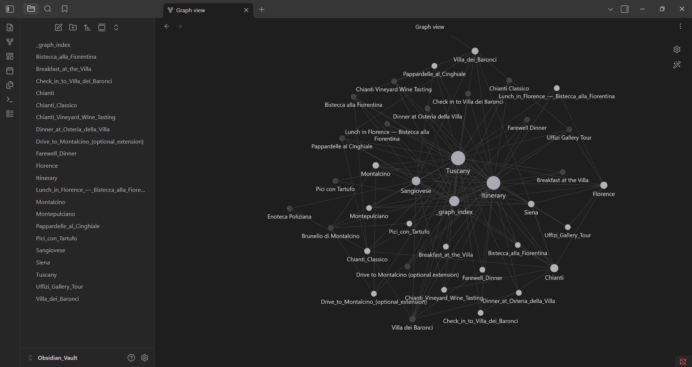
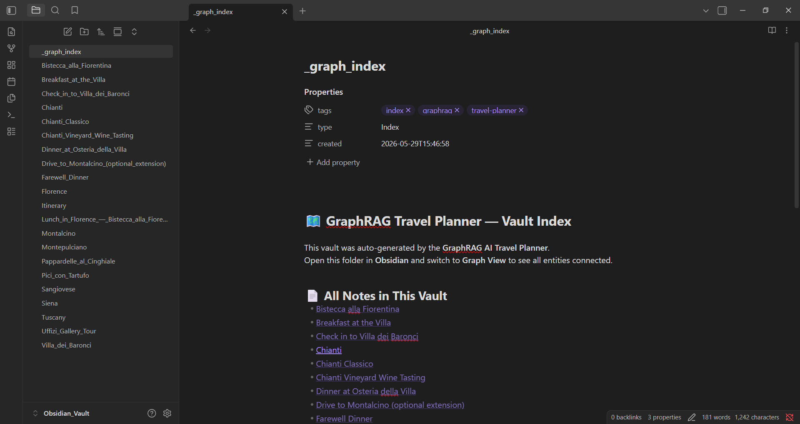

# 🌍 GraphRAG AI Travel Planner

Welcome to the **GraphRAG AI Travel Planner**, an autonomous system that combines the power of Large Language Models (LLMs) with Neo4j Graph Databases to generate hyper-personalized, interconnected travel itineraries.

This project ingests unstructured travel data (like blogs or articles), extracts entities and relationships into a strict ontology, and uses a GraphRAG agent to plan trips. Finally, it exports the itinerary as an interconnected **Obsidian Vault** for visual exploration.

---

## 📸 Sneak Peek: Obsidian Graph View

Once generated, you can open the output in Obsidian to see your entire itinerary mapped out visually as a knowledge graph!

*(Save your screenshots in an `assets` folder to view them here)*

### The Knowledge Graph


### The Itinerary Index


---

## 🛠️ Technology Stack
- **Graph Database**: Neo4j (via Docker)
- **AI & Orchestration**: LangChain, LlamaIndex, OpenAI (gpt-4o)
- **Data Schema**: Pydantic v2
- **Exports**: Obsidian (Markdown) & Gephi (GraphML)

---

## 🚀 How to Run the Project

### 1. Prerequisites
- [Docker & Docker Compose](https://www.docker.com/) installed
- Python 3.10+ installed
- An OpenAI API Key (added to your `.env` file)

```ini
OPENAI_API_KEY=sk-...
```

### 2. Start the Graph Database
Spin up the local Neo4j instance:
```bash
docker-compose up -d
```
*(Wait ~30 seconds for the database to fully initialize on ports 7474 and 7687).*

### 3. Run the AI Pipeline
Run the Python scripts sequentially to extract the data, generate the itinerary, and export the results:

**Ingest Data into Neo4j**:
```bash
python ingest.py
```
*(This extracts nodes and relationships from the text. If your OpenAI key hits a rate limit, it automatically uses the curated backup graph).*

**Generate the Itinerary**:
```bash
python agent.py
```
*(The GraphRAG agent queries Neo4j and synthesizes an itinerary, saving it to `itinerary.json`).*

**Generate the Obsidian Vault**:
```bash
python obsidian_export.py
```
*(This creates the `Obsidian_Vault` directory with linked markdown notes).*

**Export for Gephi Analytics (Optional)**:
```bash
python gephi_export.py
```
*(Exports the Neo4j graph into `travel_graph.graphml`).*

---

## 🗺️ How to View the Results

### View the Obsidian Graph
1. Download and open [Obsidian](https://obsidian.md/).
2. Click **Open folder as vault** and select the `Obsidian_Vault` directory in this project.
3. Open the `_graph_index.md` or `Itinerary.md` file.
4. Press `Ctrl + G` (or `Cmd + G` on Mac) to open the interactive **Graph View**. 

### View the Gephi Analytics
1. Download and open [Gephi](https://gephi.org/).
2. Go to **File -> Open** and select `travel_graph.graphml`.
3. In the Import Report window, ensure the graph type is set to **Directed Graph** and click OK.
4. Use the **Overview** tab to apply a layout (like *Force Atlas 2*) and colorize nodes to explore the network analytics.
